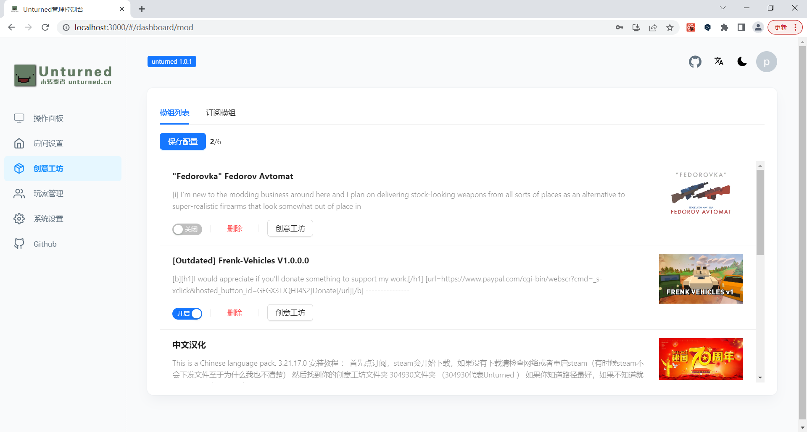

# unturned-go-app

unturned 未转变者 linux 开服面板

占用小，部署简单，界面美观（支持暗黑魔术）轻松管理房间，支持可视化的世界和模组管理，玩家日志采集等功能

预览地址： http://1.12.223.51:8084 admin 123456

部分内容还在完善中

## 预览





## 部署

### 二进制部署
1. 下载 release 包上传到服务器解压
2. 安装 steamcmd 和 unturned 服务器

    脚本默认只支持 **ubuntu** 系统，centos 等 自行百度安装steamcmd环境依赖, 面板支持自定义steamcmd路径

    ```
    sudo chmod +x install_unturned_ubuntu.sh
    ./install_unturned_ubuntu.sh
    ```
    等待执行完
3. 启动程序
    
    **注意默认是 8083 端口启动的** 修改config.yml port 就可以了
    ```
    chmod +x start.sh
    ./start.sh
    ```
4. 开放服务器防火墙 8083 端口
5. 在浏览器 访问 http://ip:8083 就完成了


## QQ群交流反馈

